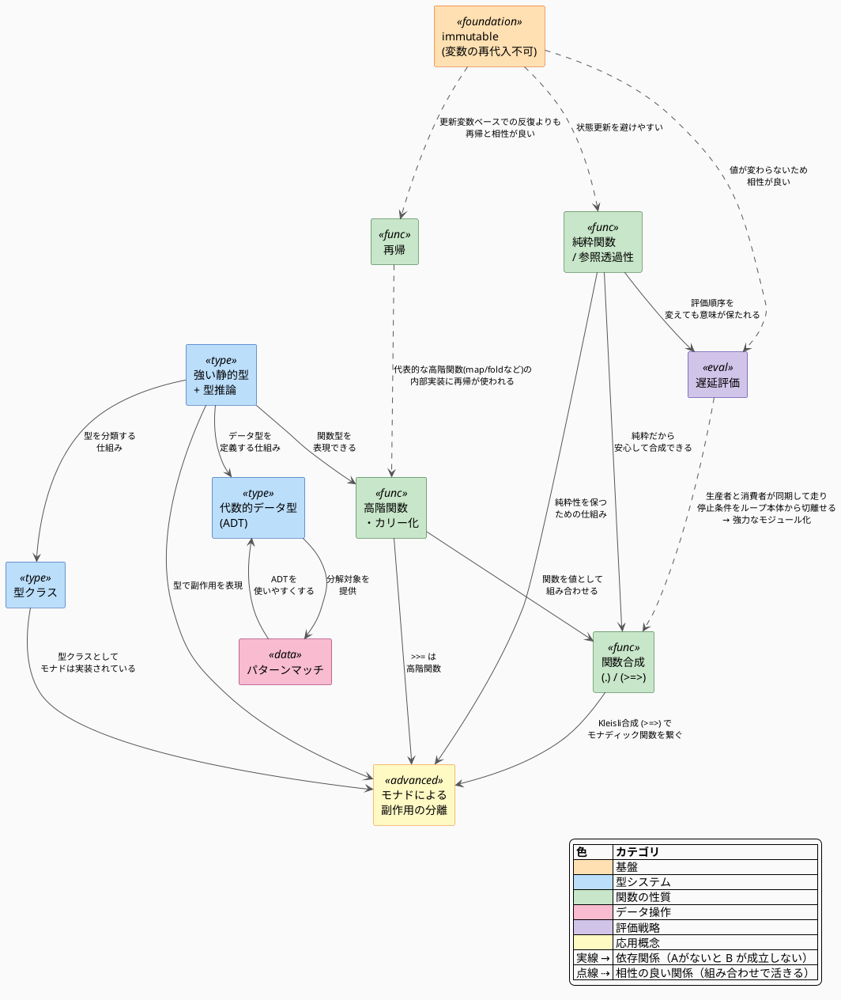

:::message
この記事はQiitaとのクロス投稿です。
https://qiita.com/sigma_devsecops/items/3f2a397e944401fcc6cb
:::

## はじめに

私は息子が産まれて育児休暇に入ったのを機に、
[Haskell](https://www.haskell.org/)という純粋関数型言語を使用した競技プログラミング([AtCoder](https://atcoder.jp/))を始めた。

Haskellの学習は(多少)膠着状態に入り、(学習を開始してから)八ヶ月あまりが過ぎた。

少しずつ、Haskellに対する理解も深まってきており、プログラミングを初めた頃のような高揚感を感じているのだが、あまりこの良さが周囲に伝わっていないような気がする。

そのため、この記事を通して、Haskellをまったく知らない人にHaskellのおもしろさを少しでも伝えられれば良いなと思っている。

### 環境

サンプルコードはGHC 9.6.7で動作確認。

---

## 関数型プログラミングは「純粋関数」という縛りで強くなる

Haskellについて語る前にまず、関数型プログラミングについて語らねばなるまい。

イメージが湧きにくいと思うので漫画にたとえて説明する。
HUNTER×HUNTERでは、念能力者が自らにルール（制約）を課し、それを心に誓う（誓約）ことで能力を飛躍的に強化する「制約と誓約」という技術が存在する。


呪術廻戦でも、自分自身または他者と誓約を結び、制限（制約）を設けることで呪力を底上げしたり、能力を強化する。

関数型プログラミングでは、「純粋関数」という縛りを設けることで従来のプログラミング言語(手続き型言語)と比べて豊かな表現能力を獲得している。

### 純粋関数とはなにか?

純粋関数とは以下の2つの性質を持つ関数のことであり、数学における関数にたとえて説明されることがある。

https://www.schoolofhaskell.com/school/starting-with-haskell/basics-of-haskell/3-pure-functions-laziness-io

- 参照透過性
  - 同じ引数に対して常に同じ結果を返す
  - 関数は状態をもたず、外部依存なし
- 副作用を持たない
  - 関数を呼び出すことで、戻り値以外の影響が生じない

要するに純粋関数とは、与えた引数に対して戻り値を返す以外のことをしない関数のことである。

#### 純粋でない関数になる処理例

- IO処理
- グローバル変数やインスタンス変数の変更
- 例外送出
- ランダムな値を扱う

#### 純粋関数を使うメリット

- 数学の高度な抽象化を使用できる
    - コード量が少なくなる
    - コンパイラなどの処理系にまかせて最適化できる領域が大きくなる
- 並行/並列化がしやすい
	- 現代のCPUはコア数が増える方向にすすんでいるので、並行/並列化しないと速くなりにくい
	- 参照透過性があると並列化しやすい
- 純粋関数のテストは単純な単体テストでかける
- 副作用があるコードを分離することにつながる

---

## 関数型プログラミング言語とは

https://ja.wikipedia.org/wiki/%E9%96%A2%E6%95%B0%E5%9E%8B%E3%83%97%E3%83%AD%E3%82%B0%E3%83%A9%E3%83%9F%E3%83%B3%E3%82%B0
> 関数型プログラミング（かんすうがたプログラミング、英: functional programming）とは、数学的な意味での関数を主に使うプログラミングのスタイルである

> 関数型プログラミング言語とは、関数型プログラミングを推奨しているプログラミング言語である[1]。略して関数型言語ともいう

大雑把に、関数の組み合わせでプログラミングをすることを関数型プログラミング、これを実施するための言語を関数型プログラミング言語というくらいに思っておけばよい。

### 関数型プログラミング言語におけるHaskellの立ち位置

関数型プログラミング言語は、すべての関数が参照透過性を持つ純粋関数型プログラミング言語とそうでない非純粋関数型言語に分類される。

本記事で主に取り上げるHaskellは、評価戦略として遅延評価を採用している。

---

## とりあえず、Haskellのコードを見て美しさを感じる

(自分の過去記事[^1]から一部抜粋)

:::message alert
Pythonは好きな言語なのでネガキャンをしたいわけではない。
一般に認知度が高いことと自分が書き慣れているためHaskellの比較対象としてPythonを選んでいる。
:::

Pythonを使い、手続き型でクイックソートを書いてみる。

:::message
クイックソートを忘れてしまった人は[Wikipedia](https://ja.wikipedia.org/wiki/%E3%82%AF%E3%82%A4%E3%83%83%E3%82%AF%E3%82%BD%E3%83%BC%E3%83%88)のGIFを見て思い出すべし。
:::

```python
# 再帰なし、手続き型
def qsort_iter(xs):
    xs = list(xs)  # 破壊を避けるならコピー
    stack = [(0, len(xs) - 1)]

    while stack:
        left, right = stack.pop()
        if left >= right:
            continue

        # パーティション
        pivot = xs[right]
        i = left
        for j in range(left, right):
            if xs[j] < pivot:
                xs[i], xs[j] = xs[j], xs[i]
                i += 1

        xs[i], xs[right] = xs[right], xs[i]

        # 右側・左側をスタックに積む（順序は任意）
        stack.append((left, i - 1))
        stack.append((i + 1, right))

    return xs
```

Haskellが再帰を使っているのに対して、Pythonが再帰を使っていないという反論があるかと思うので、再帰バージョンのPythonのコードも載せておく。

```python
def qsort(xs):
    if not xs:
        return []
    x, *rest = xs
    less = [a for a in rest if a < x]
    more = [a for a in rest if a >= x]
    return qsort(less) + [x] + qsort(more)
```

では、Haskellで書くとどうなるだろうか。

[Why Haskell matters](https://wiki.haskell.org/Why_Haskell_matters)に記載のある、クイックソートは簡潔で美しい。

```haskell
qsort :: (Ord a) => [a] -> [a]
qsort [] = []
qsort (x:xs) = qsort less ++ [x] ++ qsort more
    where less = filter (<x)  xs
          more = filter (>=x) xs
```

注目してほしいのは、Haskellのコードは完全にクイックソートとは何かという構造を記述している。コンピュータに対する命令をstep-by-stepで示しているのではない。

Pythonと比較すると、Haskellを使って実装することに以下のメリットがあると考える。

- 再帰を使う強制力が一定働くことと(手続き型の書き方になりにくい)
- より宣言的でわかりやすい
    - Haskellの場合、` qsort (x:xs) = qsort less ++ [x] ++ qsort more`だけを見ればクイックソートの本質を思い出せる
    - Pythonの場合、再帰に`less`や`more`の定義が目に入ってしまう。

そのため、パッと見で何をやっているコードであるかを把握しやすい形でコードを書けるのがとても嬉しい。

---

## Haskellとはどんな言語なのか

Haskellのなかで自分が、代表的と思う特徴をピックアップし、(自分が認識できている範囲での)世界地図を作ってみた。
Haskellの機能/制約が相互に関係しあい、別の機能を獲得しているのがわかる。



この記事ですべてについて語ると、初心者向けではなくなってしまうので、以下に絞って説明する。

- immutable(不変)
- パターンマッチ
- 再帰
- 遅延評価

### immutable(不変)

Haskellのデータ構造はimmutableである。

これを聞くと、Rustが思い浮かぶかもしれないが、自分は少し性質が違うと思っている。

[The Rust Programming Language 日本語版](https://doc.rust-jp.rs/book-ja/ch03-01-variables-and-mutability.html#%E5%A4%89%E6%95%B0%E3%81%A8%E5%8F%AF%E5%A4%89%E6%80%A7)では、

> 変数は標準で不変

と記載されているが、Rustは`mut`をつけるだけで再代入可能になる。

Haskellの場合は、値と名前を結びつけるというイメージで束縛(binding)という言葉が使われる。

小難しいことを書いたが、使用感としては不変な変数とあまり変わらないと思う。

同じ変数名での再束縛(再宣言)は問題ないが、再代入はコンパイルエラーになる。

```haskell
main :: IO ()
main = do
  let x = 5
  -- 別スコープでの新しい束縛
  let x = 10
  print x -- 10
```

```haskell
main :: IO ()
main = do
  let x = 5
  -- 再代入はコンパイルエラー
  x = 10
  print x
```

:::message
再束縛はdo記法内の`let`で許される動作であり、`where`句や同一の`let ... in ...`内で同名定義を書くとコンパイルエラーになる。また`-Wall`を有効にすると`-Wname-shadowing`の警告が出る。
:::

### パターンマッチ

Haskellではパターンマッチという記法が好まれる。

例として、引数が3のときと5のときだけ事前定義された文字列を返す関数を見てみる。

```haskell
fizzBuzz :: Int -> String
fizzBuzz 3 = "Fizz"
fizzBuzz 5 = "Buzz"
fizzBuzz n = show n

main :: IO()
main = do
  print $ map fizzBuzz [1..8] -- ["1","2","Fizz","4","Buzz","6","7","8"]

```

`if`などの条件分岐を使わずに引数の構造で関数定義を場合分けできることがわかる。

:::message
本来のfizzBuzzは3の倍数、5の倍数、15の倍数のときだけ事前定義された文字列を返す。
なぜ、これをサンプルコードにしなかったかというと、パターンマッチは条件で分岐するのではないからだ。
そのため、`fizzBuzz n `mod` 3 == 0 = "Fizz"`のような書き方はパターンマッチだけではできない。
:::

これの何が嬉しいかというと、パターンマッチで関数定義を場合分けしているため、ネストが深くならない点だ。
複雑なドメインロジックを記述する際には特に嬉しい。

また、引数の展開にもパターンマッチは使用できる。

```haskell
-- 要素数でパターンマッチ
cal :: [Int] -> Int
cal (a : b : c : _ : _) = a + b + c + 1000 -- 4個以上
cal [a, b, c] = a + b + c -- ちょうど3個
cal _ = error "input is invalid" -- それ未満

main :: IO ()
main = do
  print $ cal [1 .. 10] -- 4個以上 → 1+2+3+1000 = 1006
  print $ cal [1, 2, 3] -- 6
  print $ cal [1, 2] -- error

```

パターンマッチがない場合には

- リストから要素を取り出す: `!! n`
- 要素数を取得する処理

を書く必要があり、コードがわかりにくくなる。

```haskell
-- 要素数によって分岐する例（パターンマッチなし版）
cal :: [Int] -> Int
cal xs =
  let n = length xs
   in if n > 3
        then xs !! 0 + xs !! 1 + xs !! 2 + 1000 -- 4個以上
        else
          if n == 3
            then sum xs -- ちょうど3個
            else error "input is invalid" -- それ未満

main :: IO ()
main = do
  print $ cal [1 .. 10] -- 4個以上 → 1+2+3+1000 = 1006
  print $ cal [1, 2, 3] -- 6
  print $ cal [1, 2] -- error

```

やや強引な例ではあるが、引数の数ごとに関数定義を分けて記述できるメリットが感じられるだろう。

### 再帰

再帰とは、関数の定義のなかで自分自身を呼び出すことであり、Haskellでは基本的に再帰を使って手続き型言語であればループを使用するような処理を記述する。

逆にHaskellでは、Pythonの`for`文のように更新可能なループ変数を回す書き方は基本的にしない。
なぜなら、データがimmutableであるため、ループ変数を更新することを前提にした反復処理よりも再帰や高階関数を使って表現することが多いからだ。

再帰を使った単純な例を使って説明する。

#### 例: リストの合計を計算する関数

Pythonで再帰なしの`for`ループを使った実装とHaskellの再帰を使った実装を比較してみる。

```python
def sum (list_):
  total = 0
  for i in list_:
    total += i
  return total

result = sum([1,2,3])
print(result) # 6
```

```haskell
sum' :: [Int] -> Int
sum' [] = 0
sum' (x:xs) = x + sum' xs

main :: IO()
main = do
  let result = sum' [1,2,3]
  print result -- 6
```

:::message
`sum`ではなく、`sum'`としているのは標準ライブラリと関数名が被るのを防ぐため。
:::

先程説明した、パターンマッチがうまく機能しており、

- リストの先頭要素を取り出して`+`演算子を適用して再帰する
- リストが空になったら`sum'`が0を返すため、再帰が停止し、計算が実行される

といった仕組みで動作する。

サンプルコードにある、`sum' [1, 2, 3]`の場合には以下のように動作する。

```
動作イメージ
sum' [1,2,3]
→ 1 + sum' [2,3]
→ 1 + (2 + sum' [3])
→ 1 + (2 + (3 + sum' []))
→ 1 + (2 + (3 + 0)) ここで再帰が止まる
→ 6
```

#### 例: `filter`関数

HaskellのData.Listの[`filter`](https://hackage-content.haskell.org/package/base-4.22.0.0/docs/Data-List.html#v:filter)という関数をつかい説明する。

`filter`は、
- 第一引数: 引数を一つとり、Boolを返す関数
- 第二引数: リスト
- 戻り値: 第一引数の関数を適用して`True`になった要素だけを残したリスト

を返す関数である。

例えば、`filter (<3) [1..6]`を実行すると、1から6までのリストの中で3より小さい数のリスト`[1,2]`が返される。

`filter`は以下のように再帰を用いて実装できる。

```haskell
filter' :: (a -> Bool) -> [a] -> [a]
filter' _pred [] = []
filter' pred (x : xs)
  | pred x = x : filter' pred xs
  | otherwise = filter' pred xs

main :: IO ()
main = do
  print $ filter' (< 3) [1 .. 6] -- [1, 2]
```

:::message
Haskellでは`:`を使ってリストの先頭に要素を追加できる。
```
ghci> 1 : [2,3]
[1,2,3]
```
:::

これも先程の`sum`同様にパターンマッチの`filter' _pred [] = []`を終了条件にして再帰が停止する。

```
動作イメージ
filter' (<3) [1..6]
→ 1 : filter' (<3) [2..6]
→ 1 : (2 : filter' (<3) [3..6])
→ 1 : (2 : filter' (<3) [4..6])
→ 1 : (2 : filter' (<3) [5..6])
→ 1 : (2 : filter' (<3) [6])
→ 1 : (2 : filter' (<3) [])
→ [1,2]
```

#### 再帰の何が嬉しい?

個人的には、ループの添字を書かなくていい点にあると思う。
構造を書くだけのHaskellなら、余計なミスは減らせる。

### 遅延評価

Haskellは遅延評価(Non-strict semantics)という式の値が実際に必要になるまで計算を行わないという評価戦略を採用している。
遅延評価戦略をとることができるのは、Haskellが、immutableであり、関数が純粋で参照透過性を持つため、評価の順序によって意味が変わりにくいからだ。

遅延評価により、表現が豊かになる例を紹介する。

### エラトステネスのふるい

注目すべきは、`[2.. ]`が無限リスト(2以上のすべての自然数)になっていることだ。
Haskellには遅延評価があるため、必要な数までしか素数は計算されず、式を定義する際にすべての2以上の自然数と書くことができる。

```haskell
-- 無限リスト + 遅延評価でエラトステネスのふるい
-- [2..] は全自然数（2以上）の無限リスト。遅延評価のおかげで必要な分だけ計算される
primes :: [Int]
primes = sieve [2 ..]
  where
    sieve (p : xs) = p : sieve [x | x <- xs, x `mod` p /= 0]

-- n番目の素数を取得
nthPrime :: Int -> Int
nthPrime n = primes !! (n - 1)

main :: IO ()
main = do
  n <- readLn :: IO Int
  print $ nthPrime n

```

:::message
厳密にはこの実装は試し割り（trial division）に近く、Melissa O'Neillの論文 ["The Genuine Sieve of Eratosthenes"](https://www.cs.hmc.edu/~oneill/papers/Sieve-JFP.pdf) によると本来のエラトステネスの篩アルゴリズムとは異なることが指摘されている(Turnerのふるいと呼ぶことも)。
動作デモとしては十分簡潔だが、厳密性を求める読者向けの注として記しておく。
:::

### フィボナッチ数列

(自分の過去記事[^2]から一部抜粋)

フィボナッチ数列とは以下のような性質を持つ数列である。

$$
\begin{cases}
a_0 = 0, \\
a_1 = 1, \\
a_n = a_{n-1} + a_{n-2}, & n \ge 2
\end{cases}
$$

Haskellの再帰と遅延評価により、簡潔でわかりやすい実装になっている。

```haskell
-- フィボナッチ数列
fibs :: [Int]
fibs = 0 : 1 : zipWith (+) fibs (tail fibs)

fibonacciNumber :: Int -> Int
fibonacciNumber n = fibs !! n

main :: IO ()
main = do
  print $ fibonacciNumber 0
  print $ fibonacciNumber 1
  print $ fibonacciNumber 2
  print $ fibonacciNumber 3
  print $ fibonacciNumber 4
  print $ fibonacciNumber 5
```

```text
0
1
1
2
3
5
```

これが何をしているか簡単に説明する。
- `0 : 1`の部分はn=0、n=1のときのフィボナッチ数の値を設定しているだけ
- `zipWith`を使ってフィボナッチ数列`fibs`と`fibs`の先頭を1つ落としたフィボナッチ数列を結合している
    ```text
    # 具体例をいれるとこんな感じ
    ghci> zipWith (+) [0,1,1,2,3] [1,1,2,3]
    [1,2,3,5]

    ghci> 0 : 1 : zipWith (+) [0,1,1,2,3] [1,1,2,3]
    [0,1,1,2,3,5]
    ```
数式風に書くと以下のような感じ。

`fibs` $[a_0, a_1, a_2, a_3, \dots]$

`tail fibs` $[a_1, a_2, a_3, \dots]$

`zipWith (+) fibs (tail fibs)`

$$[a_0, a_1, a_2, \dots] +\ [a_1, a_2, a_3, \dots]
= [a_0+a_1,\ a_1+a_2,\ a_2+a_3,\dots]$$

したがって、再帰的に
$$
a_n = a_{n-1} + a_{n-2}
$$
という関係をHaskellが簡潔に表現していることがわかる。

---

## まとめ

- Haskellを知らない人向けに面白さを感じてもらうために本記事を作成した。
- Haskellは関数型プログラミング言語のなかでも純粋関数型に分類され、強い制約を持つ言語である。
- 制約を活かし、手続き型言語ではできないような表現をすることが可能であり、短いコードベースでもその価値を感じることができる。
- 現状、Haskellにコミットしてすぐにリターンが得られるとは限らない。
- プログラミングに対して、手続き型とは異なる視点を獲得できるのが面白い。

---

## あとがきポエム: おもしろいだけでHaskellをやっているのか

ここまで読んでくださった方は、じゃあ、Haskellってどう役に立つの?と疑問に思ったのではないだろうか。
そのため、AI時代のHaskellについて書いておく。

### Haskellは生成AIと相性が悪い?

関数型プログラミング言語は、生成AIと相性が良くないということを報告する論文(arXivプレプリント、2026年1月投稿・未査読)が存在する。

https://arxiv.org/html/2601.02060v1

この論文では、LeetCodeから収集した課題で構成されるベンチーマークを使い、LLMモデルとプログラミング言語の関係について調査している。
モデルは、GPT-3.5、GPT-4o、GPT-5を用い、プログラミング言語はJava、Scala、OCaml、Haskellを用意し、正解率(テストケース通過するのか)、コードのクリーンさ(Linterを使い評価)を実施した。

その結果、GPT-5 は GPT-3.5 と比べて、機能的に正しいコードの数を全体として約3倍に増やしたと報告している。
ただし、Haskell や OCaml のような純粋関数型言語では、Java と比べて依然として性能差が残っている。
Javaの正解率は 22.19%から61.14%に上昇したのに対して、Haskellは14.15%から42.34%であった。

私自身もAtCoderの復習のため、Claude Codeに問題を解いてもらうことがあるが、ABCのC〜Dあたりから関数型プログラミングのよさを活かせていない冗長な実装をすることが多々あると感じている。

### 短く、明示的に副作用を記述できるHaskellのポテンシャル

しかし、HaskellにはLLMが扱ううえで大きなポテンシャルがあると私は考えている。
それは、コードが短くパーツごとに分離されている点だ。

私は競技プログラミングでHaskellを使うケースが最も多い。
そのうえで、使用するライブラリの実装をみて長いなーと感じたことがない。
むしろ短いので気軽に実装を読んでみるかという気持ちになっている。

先程でてきた、[`zipWith`](https://hackage-content.haskell.org/package/ghc-internal-9.1401.0/docs/src/GHC.Internal.List.html#zipWith)という関数の実装を見るとたった7行しかない。

```haskell
{-# NOINLINE [1] zipWith #-}  -- See Note [Fusion for zipN/zipWithN]
zipWith :: (a->b->c) -> [a]->[b]->[c]
zipWith f = go
  where
    go [] _ = []
    go _ [] = []
    go (x:xs) (y:ys) = f x y : go xs ys
```

つまり、コードの短さという点では、LLMがチェックする際の入力をかなり小さくすることができる。
これは、Haskellが高度な抽象化を扱える純粋関数型言語であることが大きなメリットではないだろうか。

また、今回紹介できなかったが、Haskellのモナドも生成AIと相性の良い概念であると考えている。
Haskellでは副作用をモナド(型)として管理する。
そのため、コード上で副作用が発生する箇所がわかりやすい。

たとえば、AIに書かせた便利ツールやGitHubで公開されているツールを会社で使う際に、「これはローカルでしか動作しないはずだが機微情報を扱う関係上、外部と通信していないか念のため調べてから導入するように」と言われたときには、モナドがある=副作用がある場所を重点的にチェックすればよい。
これは、会社人的には結構嬉しいのではないだろうか。

:::message
関数型言語ではないが、[Deno](https://deno.com/)というJavaScriptのランタイムにも実行時に副作用を明示的に指定する機能があるので、実行時にxxしないことを保証したいならこちらを使う方が楽だと思われる。
:::

追記: 同じようなことを言っている人をHackers Newsで見つけたので貼っておく。
[Agentic AI token compression](https://blog.dan-gilmour.com/post/agentic-ai-token-compression)

### 会社の勉強会で発表して得られた感想 Haskellを学ぶことは全くの無意味ではない

この記事を使い、会社の勉強会で発表した際に良い感想をいただいたので参考程度に共有する。

- 業務アプリを作る際には、冪等である場所が壊されないように隔離するよう意識しており、純粋関数を使うHaskellの考え方に通ずるものがあるのではないか
- Haskellを学んでも直接業務アプリをHaskellで書くことはないかもしれないが、Haskellを学ぶことで良いコードを書くための視座を獲得できるのではないか

これは自分も賛成しており、自分自身もHaskellを学ぶことで副作用を意識するようになったと感じている。

そのため、Haskellは万人におすすめできる言語ではないと思うが、面白いと感じた人はやってみるとなにか得られるものがあるのではないだろうか。
難しそうと感じても、AIと壁打ちしながらであればある程度学習は進むはずである。

では、良いプログラミングライフを!

---

## Haskellに興味を持った方がいれば読むとよいもの

自分が見るとよいと思った順で書いておく。

- [私がHaskell学習を推す理由](https://www.youtube.com/watch?v=z_CraKpnfuc): 元MetaエンジニアがHaskellを推す理由を語ってくれるYouTube動画
- [ミルクボーイ漫才のプロトコルでわかる Haskell](https://qiita.com/satosystems/items/b47b5a5b16e41c93de80): 楽しくHaskellの特徴の概要がわかる
- [Why Haskell Matters](https://wiki.haskell.org/Why_Haskell_matters): ※英語。Haskellの基礎的な考え方や学習するモチベーションなどを語っている
- [関数プログラミング実践入門](https://amzn.asia/d/0evQ8kup): ※有料。後半はがっつりHaskellの話だが、前半で関数プログラミング全体についてわかりやすく書いているので前半だけ読むのもあり
- [すごいHaskell入門](https://tatsu-zine.com/books/sugoi-haskell-ja): ※有料。ポップなイラストに反してめちゃくちゃわかりやすく、深いところまで知れる良い入門書。Haskellの入門書という意味では一番おすすめ。
- [なぜ関数プログラミングは重要か](https://www.sampou.org/haskell/article/whyfp.html): Chalmers大学で回し読みされたという伝説の論文。関数プログラミングの表現の豊かさを様々な例を通して学ぶことができる
- [Using Haskell in production](https://agentultra.com/blog/using-haskell-in-production/): Haskellをプロダクションで使っている方の貴重な経験がかかれている

---

## 引用した自分の記事

[^1]: https://qiita.com/sigma_devsecops/items/3f388b7553339f1de38c
[^2]: https://qiita.com/sigma_devsecops/items/24e05b6248b717aa4067

※その他の引用については記事内にリンクが貼ってある。
